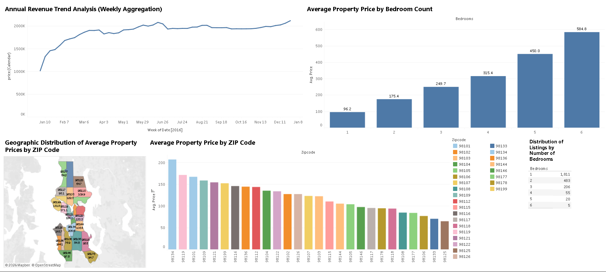

# Airbnb Pricing & Revenue Analysis Dashboard

## Overview

This project analyzes Airbnb listing data to uncover pricing trends, revenue patterns, and geographic variations in property values. The dashboard leverages weekly aggregation and multi-dimensional analysis to provide actionable insights into pricing strategy and market behavior.

## Key Insights

* Identified a steady upward **weekly revenue trend**, with peak values exceeding 2M, indicating strong seasonal demand patterns
* Analyzed pricing variation by bedroom count, observing a consistent increase from **~96 (1-bedroom)** to **~584 (6-bedroom)** properties
* Detected significant **price disparities across ZIP codes**, highlighting high-value and underpriced regions
* Mapped geographic distribution of property prices to reveal **location-driven pricing clusters**
* Observed that **1-bedroom listings dominate inventory (1,800+ listings)**, while larger properties are significantly less common

## Dashboard Features

* Weekly time-series revenue analysis
* Bedroom-wise pricing comparison
* ZIP code-level price distribution
* Geographic heatmap of property values
* Inventory distribution by bedroom count

## Tools & Technologies

* Tableau (Dashboard Development & Visualization)
* Data Cleaning & Aggregation
* Exploratory Data Analysis (EDA)

## Dashboard Preview

## Files Included

* Tableau dashboard/workbook file
* Dashboard screenshot for quick reference

* Dataset - couldn't be uploaded due to large size

## Business Impact

This analysis enables stakeholders to:

* Optimize pricing strategies based on bedroom segmentation
* Identify high-revenue time periods and seasonal demand trends
* Evaluate geographic pricing differences for investment decisions
* Understand inventory distribution to align supply with demand
